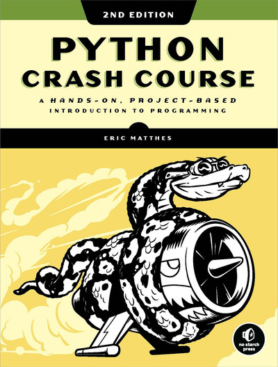

# My exercises - "Python Crash Course, 2nd Edition"

When I completed my course in Full Stack Development, I felt the need to delve deeper into Python Fundamentals, mostly for topics that I considered essentials for a developer, but were not included at all in the course, and that didn't give me the right confidence to start an independent project or apply for any job as developer, something was missing. Topics such as testing code (Unittest library), how to operate on file objects (read, enter and modify data from files), exceptions (try, except), and mainly classes. Classes were the main reason why I looked for a book. With classes you understand the difference between a function and a method, the real approach to Object Oriented Programming, and most important, a broad understanding of how a framework is built and works.

I created this repository to add the majority of the notes and exercises completed when I was studying the book "Python Crash Course, 2nd Edition". The exercises could differ sometimes from the book or, for example, I might have created customised exercises by myself to make sure I could fully understand concepts that required more focus.

I read different programming books in my life to approach different languages. Some are boring, some are interesting. I would surely suggest this book as a must to anybody who would like to start learning Python. This book is engaging, explains any concept very well, leaves no doubt, covers all the fundamental topics, and after the fundamentals you will have a clear example and project explanation about how the Django Framework works. You won't find a better book.

  

